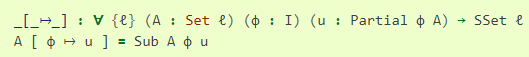

## Лаборатоная работа №0 Функциональное программирование *Agda*

#### Булко Егор Олегович
#### Группа: P3306
#### ИСУ: 372800

---

Признаюсь, я как ярый растист изначально хотел выбрать Haskell, **НО**, увидев большой перевес в его сторону, я решил посмотреть нечто другое, тогда же я увидел это...

И понял, что нужно брать! Помимо прекрасного синтаксиса, покопавшись, я обнаружил довольно неплохую документацию языка, да и понравился факт возможности интергации в него библиотек из Haskell. Выбранная мною задача предполагает преобладающее количество алгоритмических вычислений, для чего AGDA подойдет довольно хорошо. Да и буду честен, когда бы еще судьба занесла меня в его изучение!

---

Моим проектом для лаборатороной работы №4 я выбрал написание утилиты парсинга языка разметки Markdown с последующим его конвертированием в язык разметки HTML

---
В качестве литературы была вбрана онлайн книга: [Programming Language Foundations in Agda](https://plfa.github.io/). 
А также [официальная доукментация](https://agda.readthedocs.io/en/latest/index.html)

---

#### Средства разработки:

- Компилятор: agda 
- Система сборки: cabal
- Линтер: ?
- Форматтер: ? 
